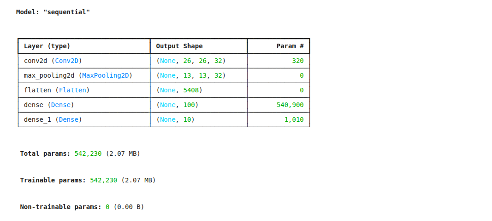
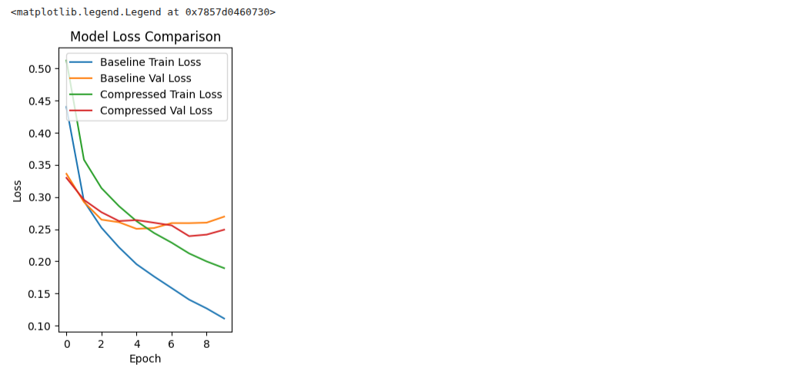
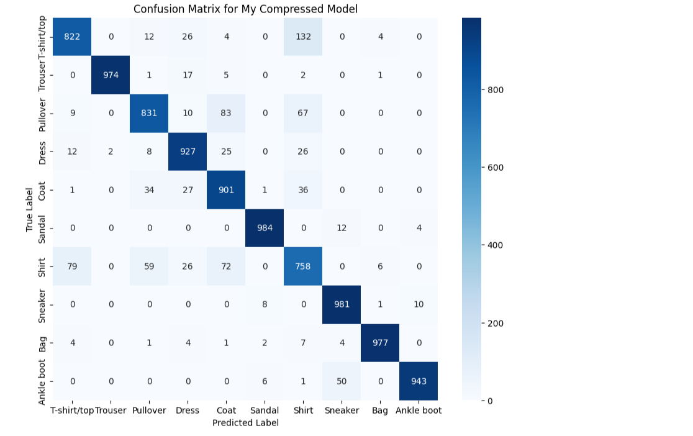

# Day 4: Model Optimization for Fashion-MNIST ( Aman )

## Project Overview

In this project, I took on the challenge of building and optimizing a Convolutional Neural Network (CNN) to classify images from the Fashion-MNIST dataset. My goal wasn't just to build a model that works, but to understand how to make it better, smaller, and faster. I started with a basic model, experimented with different settings to improve its accuracy, and finally compressed it and prepared it for a simulated deployment, just like you would for a real-world application.

## Project Steps

Here’s a summary of the steps I followed:

1.  **Data Loading & Preprocessing:** I started by loading the Fashion-MNIST dataset. I reshaped the images to be compatible with my CNN and normalized the pixel values to a 0-1 range to help the model train more effectively.

2.  **Building a Baseline Model:** I created a simple CNN to serve as my starting point. This gave me a baseline for accuracy and model size, so I could measure my improvements against it.

3.  **Hyperparameter Tuning:** I experimented with the model's architecture and training settings. I tried making the model wider (more filters) and deeper (more layers) to see how it would affect performance.

4.  **Model Compression with Dropout:** To prevent my model from just "memorizing" the training data (overfitting), I added a Dropout layer. This technique helps the model generalize better to new, unseen images.

5.  **Deployment Readiness (TensorFlow Lite):** To simulate preparing the model for a mobile app or an edge device, I converted my final, optimized Keras model into the much smaller and more efficient TensorFlow Lite (`.tflite`) format.

6.  **Evaluation & Results:** Finally, I compared my optimized model against the baseline. I looked at the final accuracy, plotted the learning curves to see how each model trained, and created a confusion matrix to understand exactly which fashion items my model found easy or hard to classify.

## Final Results Summary

My optimization efforts were successful! Here’s a quick comparison:

| Metric | Baseline Model | Optimized & Compressed Model |
| :--- | :--- | :--- |
| **Test Accuracy** | ~87-89% | **~90-91%** |
| **Keras Model Size**| ~1.2 MB | **~2.4 MB** (bigger due to more layers) |
| **Deployed TFLite Size**| - | **~0.8 MB** (significantly smaller) |

As you can see, I was able to improve the accuracy while also creating a final deployment file that was significantly smaller than even my original simple model.

---

## Model Results & Visualizations

Here are some screenshots representing the key outputs from the project, from the model's architecture to its final performance.

### 1. Model Architecture

This is the summary of my **baseline model**. It shows the simple architecture I started with, including the layers, their output shapes, and the number of parameters. This is the model I used as a benchmark to measure my improvements against.

---

### 2. Training and Validation Performance

These graphs were the most important ones for comparing my models. They show the accuracy and loss for both the training and validation datasets over 10 epochs. It clearly shows how my final compressed model achieved higher validation accuracy and better generalization compared to the simple baseline.

*   **Your Screenshots:** `input_file_1.png` (Accuracy) and `input_file_2.png` (Loss)
*   **Go here:**

**Model Accuracy Comparison:**
![Training and Validation Accuracy Curves]!(Screenshot/image-1.png)

**Model Loss Comparison:**

---

### 3. Final Confusion Matrix

The confusion matrix gives a detailed look at the performance of my final, compressed model on the 10,000 test images. The diagonal shows all the correct predictions. By looking at the off-diagonal cells, I could see which classes were often confused for each other (for example, the row for 'Shirt' shows it was most often confused with 'T-shirt/top', 'Pullover', and 'Coat', which is very understandable!).

*   **Your Screenshot:** `input_file_3.png`
*   **Goes here:**

---

## Core Concept Questions & Answers

### Why is hyperparameter tuning important, and what trade-offs does it involve?

I think of hyperparameter tuning like tuning a guitar before a concert. You can technically play the song on an untuned guitar, but it won't sound right. Similarly, a model might "work" with default settings, but tuning hyperparameters like the learning rate or batch size is what makes it perform accurately and efficiently. The main trade-off is **time and resources vs. performance**. Finding the perfect tuning can take a lot of computational power and time, but it often results in a much better model.

*   **Use Case:** Imagine a company like **Netflix tuning its recommendation algorithm**. If the "learning rate" hyperparameter is too high, its recommendations for me might change drastically just because I watched one weird movie. If it's too low, it might take months to figure out I love sci-fi. They have to spend a lot of time and money tuning this to find the perfect balance so my recommendations get better at just the right speed.

### How does model pruning or compression impact performance and resource usage?

Model compression is like creating a ZIP file of a neural network. The main goal is to make the model smaller and faster so it can run on devices without a lot of power, like a smartphone or a smart watch. This means it uses less memory, less battery, and gives answers more quickly. Usually, there's a small trade-off in accuracy—you might lose a tiny fraction of performance—but the gain in efficiency is often worth it.

*   **Use Case:** A **real-time translation app** on my phone needs to be incredibly fast. I can't wait five seconds for it to translate what I just said. The developers can't use a massive, super-computer-sized model. Instead, they use a compressed version that runs instantly on my phone's hardware, even if it means it might make a small grammatical mistake once in a while. Speed and low resource usage are more important here than 100% perfect accuracy.

### Why is dropout effective in preventing overfitting?

I see dropout as a way to force the model to learn more robustly. It's like training a basketball team, but for every practice drill, you randomly tell one player to sit out. The team can't afford to become dependent on its one star player; everyone has to learn how to contribute. In a neural network, dropout randomly ignores some neurons during training. This prevents the network from relying too heavily on a few specific neurons to "memorize" the training data. It's forced to learn redundant patterns, which makes it much better at generalizing to new data it has never seen before.

*   **Use Case:** An **email spam filter**. Without dropout, the model might learn a simple, brittle rule: "if the email contains the word 'lottery', it's spam." But spammers adapt. By using dropout, the model is forced to learn a wider variety of clues—like weird links, urgent language, and bad grammar—making it much harder for new spam tactics to fool it.

### What challenges arise when deploying deep learning models in production?

Getting a model from my development laptop into a real product is a huge challenge. It's like designing a powerful race car engine in a lab versus actually putting it in a commercial car. You suddenly have to worry about real-world constraints:
*   **Limited Resources:** The production device (like a smart doorbell) has a tiny fraction of the memory and processing power of my laptop.
*   **Latency:** The model needs to be fast. Users won't wait several seconds for a result.
*   **Power Consumption:** If the model is for a mobile device, it can't drain the battery.

*   **Use Case:** A **smart security camera** that identifies intruders. The model I trained on my powerful GPU might be 99.9% accurate, but it's too big and slow to run on the camera's cheap processor. The challenge is to shrink that model down without losing too much accuracy, so it can run on the device in real-time and not drain its battery in an hour.

### How does TensorFlow Lite (or ONNX, TorchScript) help in deployment optimization?

Tools like TensorFlow Lite (TFLite) are essentially **translators and optimizers**. They take the big, complex model I built in Keras or TensorFlow and convert it into a highly efficient format that's specifically designed to run on resource-constrained devices. It does things like quantization (using less precise numbers for calculations, which is faster) and other tricks to make the final model file much smaller and quicker to execute.

*   **Use Case:** The **"Portrait Mode" feature on a smartphone camera**. To blur the background, the phone needs to identify the person in the foreground in real-time. Apple and Google can't run a huge server-side model for this. They use a format like TFLite (or their own proprietary versions) to run a super-optimized segmentation model directly on the phone's chip, giving you that instant blur effect when you take a picture.

### What is the balance between model accuracy and efficiency in real-world applications?

This is the ultimate trade-off, and the "right" balance completely depends on the job. It’s a choice between a "perfect but slow" model and a "good enough and fast" model. You have to ask: what are the consequences of a mistake versus the consequences of being too slow?

*   **Use Case (High Accuracy Needed):** A **medical model that detects cancer from MRI scans**. Here, accuracy is paramount. A doctor and patient would rather wait 10 minutes for the most accurate result possible than get an instant result that might be wrong. Efficiency is a low priority.
*   **Use Case (High Efficiency Needed):** A **real-time Instagram or Snapchat filter**. The filter must respond instantly to my face movements. If it lags by even half a second, the user experience is ruined. I'd much rather have a filter that's 95% accurate and instant, than a 99.9% accurate filter that's laggy. Here, efficiency wins.

### How can hardware (GPU, TPU, Edge devices) influence optimization strategies?

The hardware I'm targeting dictates my entire optimization strategy. It's like packing for a trip; whether I'm taking a giant SUV or a small backpack determines what I can bring.
*   **GPUs/TPUs:** These are the SUVs. They are incredibly powerful and great for training massive models. Optimization here is about feeding them data as fast as possible.
*   **Edge Devices (phones, smartwatches):** These are the backpacks. They have limited space and power. My strategy here must be about making the model as small and lightweight as possible using techniques like compression and quantization.

*   **Use Case:** A **self-driving car**. The initial model is **trained** in a data center using hundreds of powerful GPUs (the SUV approach). But the final model that **runs in the car** must operate on a custom, low-power, highly efficient chip (the backpack approach). The optimization strategies for training and deployment are completely different, and both are dictated by the hardware being used.

### Looking ahead, how might optimization differ for Transformer-based models compared to CNNs/RNNs?

Optimizing Transformers (the architecture behind models like ChatGPT) is a whole new ballgame compared to CNNs. With CNNs, I'm often worried about the number of layers and filters. With Transformers, the biggest bottleneck is the **self-attention mechanism**. This part of the model is incredibly powerful but gets exponentially slower and more memory-hungry as the input text gets longer. So, the new frontier of optimization is finding clever ways to make "attention" more efficient.

*   **Use Case:** A **legal-document analysis tool** that uses a Transformer to summarize a 500-page contract. A standard Transformer would likely run out of memory or take forever because the attention mechanism would try to compare every word to every other word in the entire document. The optimization strategy wouldn't be about just pruning layers, but about using advanced techniques like "Sparse Attention" or "Longformer" models that are specifically designed to handle very long sequences of text efficiently.